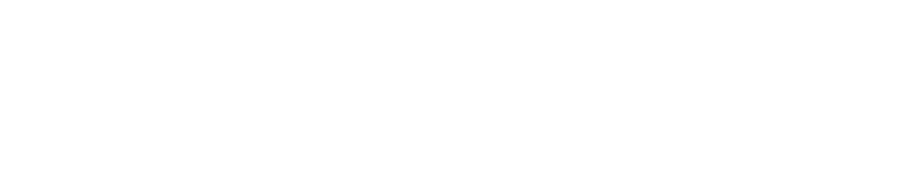
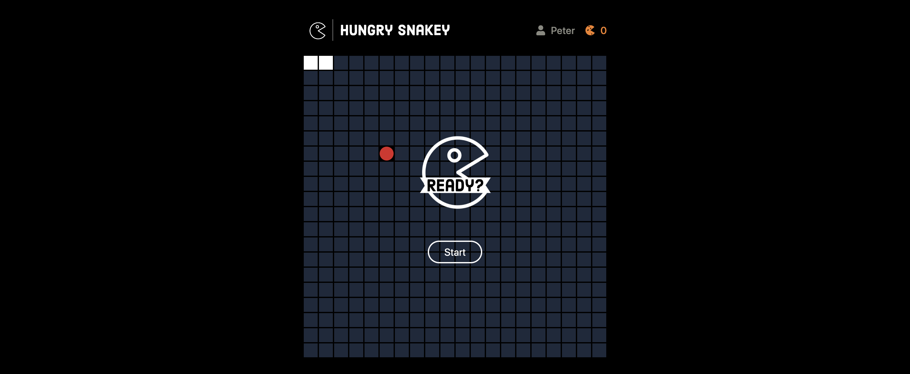

  

  

    <a href="https://hungry-snakey.web.app/">Demo</a>
    |
    <a href="https://github.com/peipeix2/Filter/#Contact">Contact</a>
  

# About

[Hungry Snakey](https://hungry-snakey.web.app/) is a clone to the classic Snake game.

## Built with

     

**Base**

- React app
- Firebase
- Tailwind
- Prettier

**Libraries**

- Zustand

### Contact

- [LinkedIn](https://www.linkedin.com/in/pei-pei-hsueh-1a8a4a7a/)
- [Email](mailto:peipei.hsueh@outlook.com)
